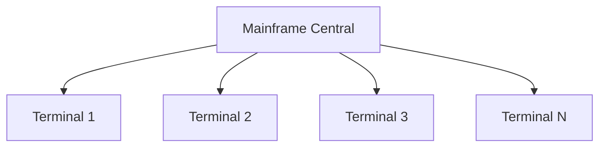
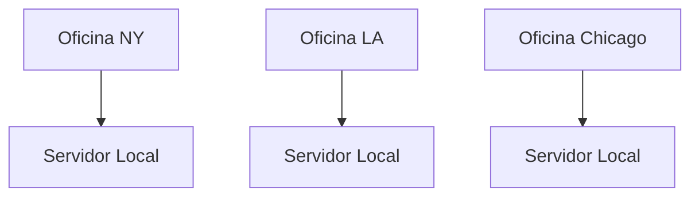
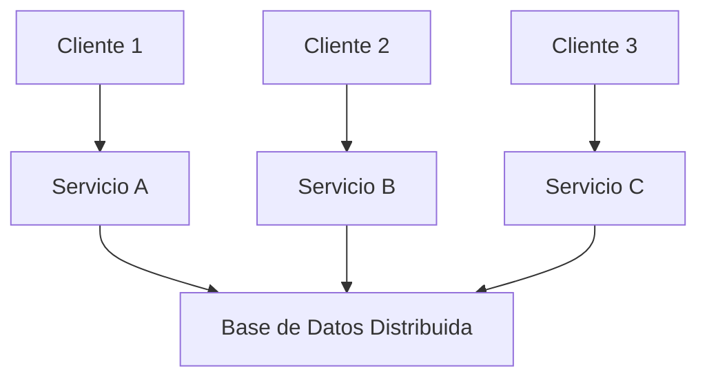
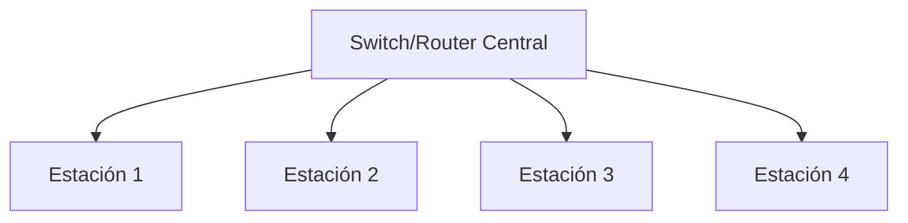
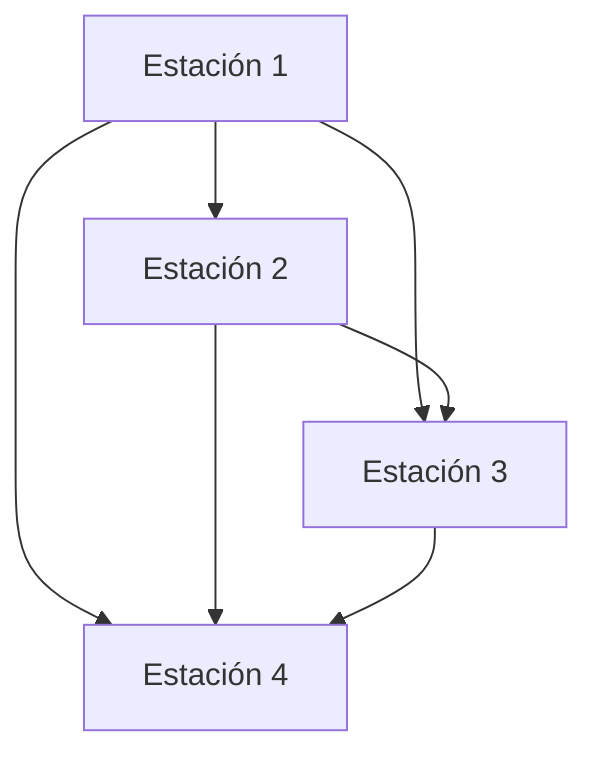

# Teleproceso, Redes y Modelos de Comunicación

## 📡 Resumen de Avances Clave en Teleproceso y su Impacto en la Sociedad Digital

### Definición de Teleproceso
Procesamiento de datos a distancia donde terminales remotos se conectan a un computador central para el intercambio de información.

### Avances Clave y su Impacto

| Era | Avance Tecnológico | Impacto en la Sociedad |
|-----|-------------------|------------------------|
| **1960s** | **Mainframes y Terminales Tontas** | Primeros sistemas empresariales centralizados |
| **1970s** | **Modems y Líneas Conmutadas** | Comunicación entre oficinas distantes |
| **1980s** | **Redes Locales (LAN)** | Oficinas automatizadas, compartir recursos |
| **1990s** | **Internet Comercial** | Globalización, comercio electrónico |
| **2000s** | **Banda Ancha y Móvil** | Sociedad siempre conectada, redes sociales |
| **2010s** | **Cloud Computing y IoT** | Transformación digital, ciudades inteligentes |
| **2020s** | **5G y Edge Computing** | Tiempo real, realidad aumentada, automatización |

**Impacto Global:**
- Revolución en la comunicación interpersonal y empresarial
- Globalización económica y cultural
- Nuevos modelos de negocio (plataformas digitales)
- Transformación del mercado laboral (teletrabajo)
- Acceso inmediato al conocimiento y entretenimiento

---

## 🏗️ Evolución desde Sistemas Centralizados hasta Arquitecturas Distribuidas

### 1. Sistemas Centralizados (1960-1980)


**Características:**
- Todo el procesamiento en un servidor central
- Terminales "tontas" sin capacidad de procesamiento
- Control absoluto y seguridad centralizada
- Single point of failure

**Ejemplo:** Sistemas bancarios antiguos, reservas de aerolíneas

### 2. Sistemas Descentralizados (1980-1990)


**Características:**
- Múltiples sistemas independientes
- Duplicación de recursos y datos
- Poca colaboración entre sistemas
- Sincronización manual de datos

### 3. Sistemas Distribuidos (1990-Presente)


**Características:**
- Recursos compartidos en la red
- Transparencia de acceso
- Escalabilidad horizontal
- Tolerancia a fallos
- Procesamiento colaborativo

**Ejemplos:** 
- **Cluster Computing:** Granjas de servidores
- **Grid Computing:** Cálculo científico distribuido
- **Cloud Computing:** AWS, Azure, Google Cloud
- **Edge Computing:** Procesamiento en el borde de la red

---

## 🌐 Topologías de Red: Ventajas y Desventajas

### Topologías Físicas Principales

#### 1. Bus Lineal
```
Estación1 ---- Estación2 ---- Estación3 ---- Estación4
     ｜              ｜             ｜             ｜
   Cable Principal (Backbone)
```

**Ventajas:**
- ✓ Fácil de implementar
- ✓ Bajo costo inicial
- ✓ Simplicidad en la instalación

**Desventajas:**
- ✗ Single point of failure (cable principal)
- ✗ Difícil diagnóstico de fallos
- ✗ Rendimiento disminuye con muchos nodos

**Caso real:** Redes Ethernet antiguas (10Base2)

#### 2. Estrella


**Ventajas:**
- ✓ Fácil administración y expansión
- ✓ Falla de un nodo no afecta a los demás
- ✓ Alto rendimiento

**Desventajas:**
- ✗ Dependencia del dispositivo central
- ✗ Mayor costo en cableado
- ✗ Single point of failure (concentrador)

**Caso real:** Redes LAN modernas, Wi-Fi doméstico

#### 3. Anillo
```
Estación1 → Estación2 → Estación3 → Estación4 → Estación1
```

**Ventajas:**
- ✓ Acceso ordenado al medio
- ✓ Buen rendimiento con mucho tráfico
- ✓ Fácil diagnóstico

**Desventajas:**
- ✗ Falla en un nodo rompe toda la red
- ✗ Complejidad en la expansión
- ✗ Latencia en redes grandes

**Caso real:** Token Ring, FDDI

#### 4. Malla (Mesh)


**Ventajas:**
- ✓ Alta redundancia y confiabilidad
- ✓ Múltiples caminos para los datos
- ✓ Excelente para misiones críticas

**Desventajas:**
- ✗ Alto costo de implementación
- ✗ Complejidad de administración
- ✗ Exceso de cableado

**Caso real:** Internet backbone, redes militares

---

## 🔄 Modelos OSI vs TCP/IP: Relación con Casos Reales

### Comparativa de Modelos

| Capa OSI | Capa TCP/IP | Protocolos | Ejemplo Real |
|----------|-------------|------------|--------------|
| **7. Aplicación** | **4. Aplicación** | HTTP, HTTPS, FTP, SMTP, DNS | Navegador web accediendo a Google.com |
| **6. Presentación** | **4. Aplicación** | SSL/TLS, JPEG, MPEG | Cifrado de datos bancarios, compresión de imágenes |
| **5. Sesión** | **4. Aplicación** | NetBIOS, RPC | Conexión persistente en Zoom/Teams |
| **4. Transporte** | **3. Transporte** | TCP, UDP | Descarga fiable de archivos (TCP) vs streaming video (UDP) |
| **3. Red** | **2. Internet** | IP, ICMP, routers | Enrutamiento de paquetes entre redes diferentes |
| **2. Enlace** | **1. Acceso a Red** | Ethernet, Wi-Fi, switches | Comunicación dentro de una red local (MAC) |
| **1. Física** | **1. Acceso a Red** | Cable UTP, fibra óptica, radio | Señales eléctricas/ópticas por el cable de red |

### Casos de Uso Reales

#### Caso 1: Navegación Web (HTTP/HTTPS)
```
Usuario → Navegador (Capa 7) → HTTPS (Capa 6) → Sesión (Capa 5) → TCP (Capa 4) → IP (Capa 3) → Ethernet (Capa 2) → Cable (Capa 1)
```

**Flujo:**
1. **Aplicación:** HTTP request del navegador
2. **Presentación:** SSL/TLS encryption (HTTPS)
3. **Sesión:** Mantener la sesión con cookies
4. **Transporte:** TCP para entrega confiable
5. **Red:** IP para direccionamiento lógico
6. **Enlace:** Ethernet para direccionamiento físico (MAC)
7. **Física:** Señales por cable/wi-fi

#### Caso 2: Llamada VoIP (Voice over IP)
```
Teléfono IP → Codec audio (Capa 6) → RTP (Capa 5) → UDP (Capa 4) → IP (Capa 3) → Wi-Fi (Capa 2) → Radio (Capa 1)
```

**Características:**
- Usa UDP en lugar de TCP (mejor velocidad, menos confiabilidad)
- Compresión de audio en capa de Presentación
- Priorización de paquetes (QoS)

#### Caso 3: Transferencia de Archivos (FTP)
```
Cliente FTP → Comandos (Capa 7) → TCP (Capa 4) → IP (Capa 3) → Red local (Capas 2-1)
```

**Particularidades:**
- Usa dos conexiones: control (puerto 21) y datos (puerto 20)
- Autenticación en capa de Aplicación
- Transferencia confiable mediante TCP

### Tendencias Actuales

- **Convergencia hacia TCP/IP:** Modelo dominante a nivel global
- **Simplificación:** Modelo híbrido práctico de 4 capas
- **Nuevos protocolos:** HTTP/2, QUIC para mejor performance web
- **Seguridad integrada:** TLS 1.3 como estándar en capa de Transporte
```

